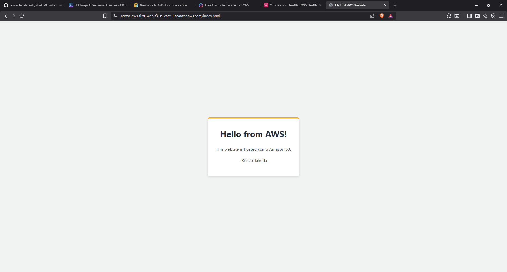

# AWS S3 Static Website

This is my first static website hosted on **Amazon S3**.

---

## Live Website

You can view the website here:  
[My Website](https://renzo-aws-first-web.s3.us-east-1.amazonaws.com/index.html)



---

## Project Overview

- **Bucket name:** renzo-aws-first-web  
- **AWS Region:** us-east-1  
- **Hosting type:** Static website  
- **Index document:** index.html  
- **Public access:** Enabled via bucket policy  

This project demonstrates a simple static website deployment on AWS S3 using a bucket policy to allow public read access.

---

## Steps Taken

1. **Create S3 Bucket**  
   - Created a general-purpose bucket named `renzo-aws-first-web`.  
   - Ensured that **Block Public Access** is turned off for the bucket.  

2. **Enable Static Website Hosting**  
   - Bucket → Properties → Static website hosting → Edit → Enable  
   - Hosting type: Host a static website  
   - Index document: `index.html`  
   - Error document: left blank for now  

3. **Upload Website Content**  
   - Uploaded `index.html` to the **root of the bucket**.  
   - Confirmed the file name is exactly `index.html` (case sensitive).  

4. **Add Bucket Policy for Public Access**  
   - Bucket → Permissions → Bucket policy → Edit  
   - Added the following JSON:

```json
{
  "Version": "2012-10-17",
  "Statement": [
    {
      "Sid": "PublicReadGetObject",
      "Effect": "Allow",
      "Principal": "*",
      "Action": "s3:GetObject",
      "Resource": "arn:aws:s3:::renzo-aws-first-web/*"
    }
  ]
}
